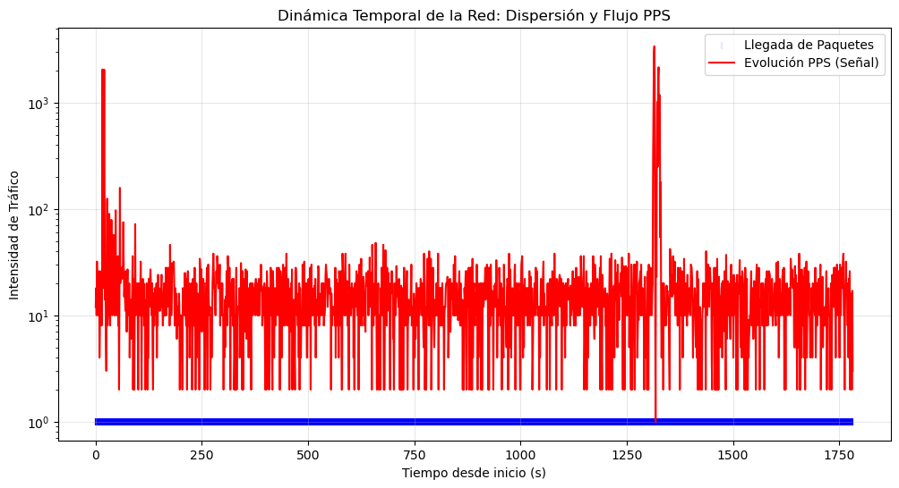
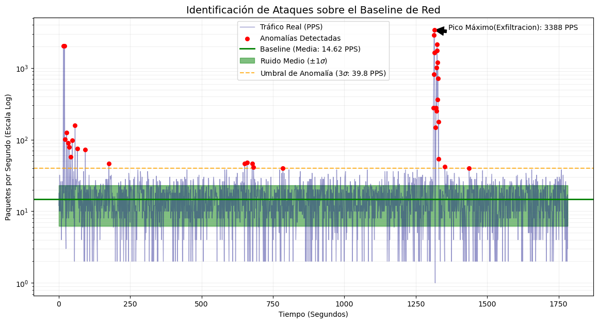
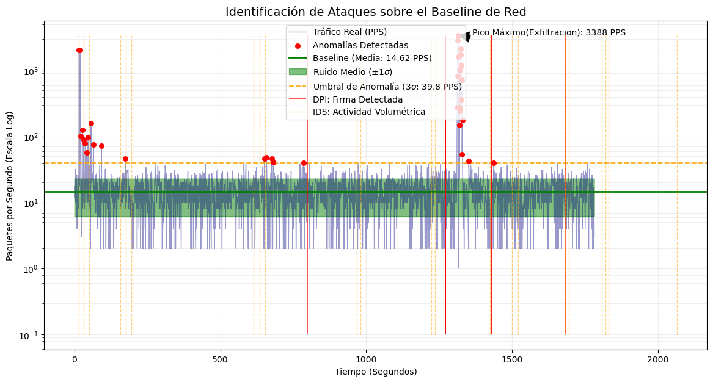
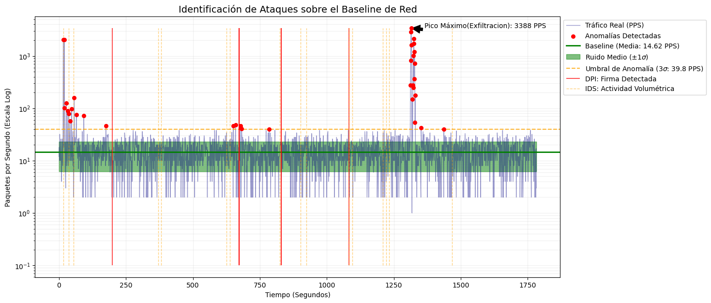

```python
import scapy.all as scapy
import numpy as np
import matplotlib.pyplot as plt

# 1. Leemos el archivo (iterando para no saturar la RAM)
pcap_file = "samba-realtime.pcap"
packets = scapy.PcapReader(pcap_file)

tiempos = []

# 2. Bucle
for pkt in packets:
    # Extraemos el atributo 'time' (el timestamp de llegada)
    # y lo guardamos en nuestra lista
    tiempos.append(float(pkt.time))

# 3. Convertimos a tiempos relativos (empezando desde 0)
tiempos = np.array(tiempos)
tiempos_relativos = tiempos - tiempos[0]

# 4. Agrupamos por segundos (Histograma)
# Queremos saber: ¿Cuántos paquetes hay en el segundo 1? ¿Y en el 2?
segundos_totales = int(np.ceil(tiempos_relativos.max()))
counts, bins = np.histogram(tiempos_relativos, bins=range(segundos_totales + 1))

print(f"He analizado {len(tiempos)} paquetes en {segundos_totales} segundos.")
```

    He analizado 45819 paquetes en 1783 segundos.


```python
import pandas as pd
#Data frame con tiempo en formato Unix Epoch
df_timestamp = pd.DataFrame({'time_stamp' : tiempos, 'valor' : 1})
# Convertimos el Unix Epoch a objetos datetime de Pandas
df_timestamp['hora_completa'] = pd.to_datetime(df_timestamp['time_stamp'], unit='s')

# Creamos la columna con el formato exacto [HH:MM:SS] que me pediste
df_timestamp['formato_24h'] = df_timestamp['hora_completa'].dt.strftime('[%H:%M:%S]')

# Calculamos también el tiempo relativo (segundos desde el inicio) 
df_timestamp['tiempo_relativo'] = df_timestamp['time_stamp'] - df_timestamp['time_stamp'].iloc[0]

print(df_timestamp[['time_stamp', 'formato_24h', 'tiempo_relativo']].head())
```

         time_stamp formato_24h  tiempo_relativo
    0  1.772623e+09  [11:23:07]         0.000000
    1  1.772623e+09  [11:23:07]         0.000039
    2  1.772623e+09  [11:23:07]         0.000562
    3  1.772623e+09  [11:23:07]         0.000994
    4  1.772623e+09  [11:23:07]         0.001018


```python
import pandas as pd
#Crear un DataFrame para manejarlo como una serie temporal
df = pd.DataFrame({'tiempo': tiempos_relativos, 'valor': 1})
df.head()
```


<div>
<style scoped>
    .dataframe tbody tr th:only-of-type {
        vertical-align: middle;
    }

    .dataframe tbody tr th {
        vertical-align: top;
    }

    .dataframe thead th {
        text-align: right;
    }
</style>
<table border="1" class="dataframe">
  <thead>
    <tr style="text-align: right;">
      <th></th>
      <th>tiempo</th>
      <th>valor</th>
    </tr>
  </thead>
  <tbody>
    <tr>
      <th>0</th>
      <td>0.000000</td>
      <td>1</td>
    </tr>
    <tr>
      <th>1</th>
      <td>0.000039</td>
      <td>1</td>
    </tr>
    <tr>
      <th>2</th>
      <td>0.000562</td>
      <td>1</td>
    </tr>
    <tr>
      <th>3</th>
      <td>0.000994</td>
      <td>1</td>
    </tr>
    <tr>
      <th>4</th>
      <td>0.001018</td>
      <td>1</td>
    </tr>
  </tbody>
</table>
</div>


```python
# 1. Redondeamos el tiempo de cada paquete al segundo más cercano
# Si un paquete llegó en el 1.2s y otro en el 1.8s, ambos van al "Segundo 1"
df['segundo'] = df['tiempo'].astype(int)

# 2. Agrupamos por ese segundo y contamos cuántos hay
# "Dime cuántas filas hay para el Segundo 1, cuántas para el Segundo 2..."
df_resampled = df.groupby('segundo').size().reset_index(name='pps')

print(df_resampled.tail(60)) # Aquí verás: Segundo 0 -> 25 paquetes, Segundo 1 -> 22...
```

          segundo  pps
    1586     1720   26
    1587     1721    2
    1588     1722   10
    1589     1723   16
    1590     1724   14
    1591     1725   18
    1592     1726   10
    1593     1727   10
    1594     1728    2
    1595     1729    7
    1596     1730    7
    1597     1731   20
    1598     1732    2
    1599     1734   24
    1600     1735   18
    1601     1736   20
    1602     1737   12
    1603     1738   28
    1604     1739   12
    1605     1740   28
    1606     1741   10
    1607     1742    4
    1608     1743   14
    1609     1744   10
    1610     1745   30
    1611     1746   10
    1612     1747   13
    1613     1748   17
    1614     1749   26
    1615     1750   10
    1616     1751    4
    1617     1752   30
    1618     1753   20
    1619     1754   10
    1620     1755   20
    1621     1756   28
    1622     1758   18
    1623     1759   32
    1624     1760   38
    1625     1761   10
    1626     1762   10
    1627     1763    2
    1628     1764   11
    1629     1765   20
    1630     1766   32
    1631     1767   20
    1632     1769   18
    1633     1770    8
    1634     1771   20
    1635     1772    4
    1636     1773   22
    1637     1774   18
    1638     1775   26
    1639     1776    2
    1640     1777   16
    1641     1778   12
    1642     1779    8
    1643     1780    2
    1644     1781   17
    1645     1782    3


```python
# Pintar la Dispersión
plt.figure(figsize=(12, 6))

# Pintamos cada paquete como un pequeño punto (dispersión)
plt.scatter(tiempos_relativos, np.ones_like(tiempos_relativos), 
            alpha=0.1, color='blue', marker='|', label='Llegada de Paquetes')

# Pintamos la línea de PPS (Paquetes por segundo) encima
plt.plot(df_resampled['segundo'], df_resampled['pps'], 
         color='red', linewidth=1.5, label='Evolución PPS (Señal)')

plt.title("Dinámica Temporal de la Red: Dispersión y Flujo PPS")
plt.xlabel("Tiempo desde inicio (s)")
plt.ylabel("Intensidad de Tráfico")
plt.legend()
plt.grid(True, alpha=0.3)
plt.yscale('log')

plt.show()
```


    

    


```python
#Basándonos en esto defino el baseline entre 100 y 1200 segundos para tener buena estadística
media_pps = df_resampled['pps'][100:1200].mean()
std_pps = df_resampled['pps'][100:1200].std()
print(f'Media: {media_pps}\n Desviación: {std_pps}')
```

    Media: 14.623636363636363
     Desviación: 8.403397719092341


```python
# 1. Definimos umbral (esto ya lo tienes perfecto)
umbral_anomalia = media_pps + 3.0 * std_pps

# 2. IDENTIFICACIÓN DE MOMENTOS DE ATAQUE (Sobre el dataframe de SEGUNDOS)
# Usamos df_resampled porque es donde comparamos PPS vs Umbral
df_resampled['es_ataque'] = df_resampled['pps'] > umbral_anomalia
df_resampled['es_ataque'] = df_resampled['es_ataque'].fillna(False)

# 3. Filtramos los segundos culpables
ataques = df_resampled[df_resampled['es_ataque']]

# 4. Imprimimos los resultados limpios
print("--- Segundos con Tráfico Anómalo ---")
print(ataques[['segundo', 'pps']])

# 5. Lista de segundos únicos para tu informe
segundos_criticos = ataques['segundo'].tolist()
print(f"\n¡Anomalías críticas detectadas en los segundos: {segundos_criticos}!")
```

    --- Segundos con Tráfico Anómalo ---
          segundo   pps
    15         16  2050
    18         20  2042
    19         21   101
    25         27   125
    30         32    90
    34         37    79
    38         42    57
    43         47    97
    53         57   158
    58         65    75
    83         93    72
    162       175    46
    596       651    46
    603       659    48
    620       677    46
    625       682    41
    722       785    40
    1209     1312   279
    1210     1313   823
    1211     1314  2898
    1212     1315  3388
    1213     1316  1626
    1216     1319   148
    1218     1321   276
    1219     1322  1012
    1220     1323   250
    1221     1324  1740
    1222     1325  2149
    1223     1326   362
    1224     1327  1187
    1225     1328   716
    1226     1329    54
    1227     1330   178
    1249     1352    42
    1324     1437    40
    
    ¡Anomalías críticas detectadas en los segundos: [16, 20, 21, 27, 32, 37, 42, 47, 57, 65, 93, 175, 651, 659, 677, 682, 785, 1312, 1313, 1314, 1315, 1316, 1319, 1321, 1322, 1323, 1324, 1325, 1326, 1327, 1328, 1329, 1330, 1352, 1437]!


```python
#EL DIBUJO
plt.figure(figsize=(14, 7))

# Pintamos todos los datos de la red (los normales y los ataques)
plt.plot(df_resampled['segundo'], df_resampled['pps'], color='navy', 
         label='Tráfico Real (PPS)', alpha=0.4, linewidth=1)

# Resaltamos los momentos identificados como 'ataques' con puntos rojos
plt.scatter(ataques['segundo'], ataques['pps'], color='red', 
            label='Anomalías Detectadas', zorder=5, s=30)

# Pintamos la Baseline (Media) y el Ruido (Desviación)
plt.axhline(y=media_pps, color='green', linestyle='-', 
            label=f'Baseline (Media: {media_pps:.2f} PPS)', linewidth=2)

# Sombreado de la zona de ruido medio (±1 sigma)
plt.fill_between(df_resampled['segundo'], media_pps - std_pps, media_pps + std_pps, 
                 color='green', alpha=0.5, label='Ruido Medio (±1$\sigma$)')

# Pintamos tu umbral de anomalia (3 sigmas)
plt.axhline(y=umbral_anomalia, color='orange', linestyle='--', 
            label=f'Umbral de Anomalía (3$\sigma$: {umbral_anomalia:.1f} PPS)', alpha=0.8)


# Usamos escala logarítmica 
plt.yscale('log')

# Títulos y etiquetas con tu estilo
plt.title('Identificación de Ataques sobre el Baseline de Red', fontsize=14)
plt.xlabel('Tiempo (Segundos)')
plt.ylabel('Paquetes por Segundo (Escala Log)')
plt.grid(True, which="both", ls="-", alpha=0.2)
plt.legend(loc='upper center')

# Anotamos el pico máximo
pico_max_seg = ataques.loc[ataques['pps'].idxmax(), 'segundo']
pico_max_val = ataques['pps'].max()
plt.annotate(f'Pico Máximo(Exfiltracion): {pico_max_val} PPS', 
             xy=(pico_max_seg, pico_max_val), xytext=(pico_max_seg+50, pico_max_val),
             arrowprops=dict(facecolor='black', shrink=0.05), fontsize=10)

plt.show()
```


    

    


```python
# Vamos a comparar con la sonda:
import re
from datetime import datetime
log_data='''
[06:13:35]  Actividad interactiva: Posible Escaneo - Ráfaga: 14pkts/s
[06:13:50]  Actividad interactiva: Posible Escaneo - Ráfaga: 6pkts/s
[06:14:09]  Actividad interactiva: Posible Escaneo - Ráfaga: 9pkts/s
[06:15:56]   Actividad interactiva (Shell/Teclado) - Size: 4B
[06:16:16]  Actividad interactiva: Posible Escaneo - Ráfaga: 19pkts/s
[06:16:34]  Actividad interactiva: Posible Escaneo - Ráfaga: 9pkts/s
[06:23:34]   Actividad interactiva (Shell/Teclado) - Size: 4B
[06:23:54]  Actividad interactiva: Posible Escaneo - Ráfaga: 19pkts/s
[06:24:13]  Actividad interactiva: Posible Escaneo - Ráfaga: 9pkts/s
[06:26:37]  [ALERTA DPI] Firma detectada: '.war'
   [!] CRÍTICO: Intento de subida de artefacto JAVA (.war)
--------------------------------------------------
[06:29:28]   Actividad interactiva (Shell/Teclado) - Size: 3B
[06:29:39]   Actividad interactiva (Shell/Teclado) - Size: 3B
[06:33:43]   Actividad interactiva (Shell/Teclado) - Size: 8B
[06:33:56]   Actividad interactiva (Shell/Teclado) - Size: 6B
[06:34:30]  [ALERTA DPI] Firma detectada: 'gcc'
--------------------------------------------------
[06:34:30]  [ALERTA DPI] Firma detectada: 'ptrace'
--------------------------------------------------
[06:34:30]  [ALERTA DPI] Firma detectada: 'firefart'
--------------------------------------------------
[06:34:30]  [ALERTA DPI] Firma detectada: 'pthread'
--------------------------------------------------
[06:34:30]  [ALERTA DPI] Firma detectada: 'ptrace'
--------------------------------------------------
[06:34:30]  [ALERTA DPI] Firma detectada: 'mmap'
--------------------------------------------------
[06:34:30]  [ALERTA DPI] Firma detectada: 'firefart'
--------------------------------------------------
[06:34:30]  [ALERTA DPI] Firma detectada: 'pthread'
--------------------------------------------------
[06:37:03]   Actividad interactiva (Shell/Teclado) - Size: 3B
[06:37:07]  [ALERTA DPI] Firma detectada: 'gcc'
--------------------------------------------------
[06:37:07]  [ALERTA DPI] Firma detectada: 'pthread'
--------------------------------------------------
[06:38:20]   Actividad interactiva (Shell/Teclado) - Size: 3B
[06:38:41]   Actividad interactiva (Shell/Teclado) - Size: 13B
[06:41:21]  [ALERTA DPI] Firma detectada: 'firefart'
--------------------------------------------------
[06:41:21]   Actividad interactiva (Shell/Teclado) - Size: 12B
[06:41:33]   Actividad interactiva (Shell/Teclado) - Size: 7B
[06:43:27]   Actividad interactiva (Shell/Teclado) - Size: 3B
[06:43:39]   Actividad interactiva (Shell/Teclado) - Size: 7B
[06:43:51]  Actividad interactiva: Posible Escaneo - Ráfaga: 6pkts/s
[06:47:45]   Actividad interactiva (Shell/Teclado) - Size: 5B
'''
#Nos quedamos con la primera aparicion del tipo ##:##:## que es la hora

# Buscamos el patrón [HH:MM:SS] seguido de todo lo que venga después en la línea
# El primer grupo ( ) es la hora, el segundo el mensaje
matches = re.findall(r"\[(\d{2}:\d{2}:\d{2})\]\s+(.*)", log_data)

# Crear DataFrame con ambas columnas
df_sonda = pd.DataFrame(matches, columns=['hora', 'mensaje'])

# Convertimos a datetime
df_sonda['dt'] = pd.to_datetime(df_sonda['hora'], format='%H:%M:%S')

# Tu T0 y el offset de 16s
t0_pcap = datetime.strptime("06:13:35", "%H:%M:%S")
df_sonda['relativo_segundos'] = ((df_sonda['dt'] - t0_pcap) + pd.Timedelta(seconds=16)).dt.total_seconds()
print(df_sonda.head(10))
```

           hora                                            mensaje  \
    0  06:13:35  Actividad interactiva: Posible Escaneo - Ráfag...   
    1  06:13:50  Actividad interactiva: Posible Escaneo - Ráfag...   
    2  06:14:09  Actividad interactiva: Posible Escaneo - Ráfag...   
    3  06:15:56   Actividad interactiva (Shell/Teclado) - Size: 4B   
    4  06:16:16  Actividad interactiva: Posible Escaneo - Ráfag...   
    5  06:16:34  Actividad interactiva: Posible Escaneo - Ráfag...   
    6  06:23:34   Actividad interactiva (Shell/Teclado) - Size: 4B   
    7  06:23:54  Actividad interactiva: Posible Escaneo - Ráfag...   
    8  06:24:13  Actividad interactiva: Posible Escaneo - Ráfag...   
    9  06:26:37               [ALERTA DPI] Firma detectada: '.war'   
    
                       dt  relativo_segundos  
    0 1900-01-01 06:13:35               16.0  
    1 1900-01-01 06:13:50               31.0  
    2 1900-01-01 06:14:09               50.0  
    3 1900-01-01 06:15:56              157.0  
    4 1900-01-01 06:16:16              177.0  
    5 1900-01-01 06:16:34              195.0  
    6 1900-01-01 06:23:34              615.0  
    7 1900-01-01 06:23:54              635.0  
    8 1900-01-01 06:24:13              654.0  
    9 1900-01-01 06:26:37              798.0  


```python
df_dpi = df_sonda[df_sonda['hora'].str.contains('Firma|ALERTA', case=False)]

# Actividad (Volumetría/Tamaño): El resto (Escaneos, Shell, etc.)
df_vol = df_sonda[~df_sonda['hora'].str.contains('Firma|ALERTA', case=False)]
print(df_dpi.head())
```

    Empty DataFrame
    Columns: [hora, dt, relativo_segundos]
    Index: []


```python
#EL DIBUJO
plt.figure(figsize=(14, 7))

# Pintamos todos los datos de la red (los normales y los ataques)
plt.plot(df_resampled['segundo'], df_resampled['pps'], color='navy', 
         label='Tráfico Real (PPS)', alpha=0.4, linewidth=1)

# Resaltamos los momentos identificados como 'ataques' con puntos rojos
plt.scatter(ataques['segundo'], ataques['pps'], color='red', 
            label='Anomalías Detectadas', zorder=5, s=30)

# Pintamos la Baseline (Media) y el Ruido (Desviación)
plt.axhline(y=media_pps, color='green', linestyle='-', 
            label=f'Baseline (Media: {media_pps:.2f} PPS)', linewidth=2)

# Sombreado de la zona de ruido medio (±1 sigma)
plt.fill_between(df_resampled['segundo'], media_pps - std_pps, media_pps + std_pps, 
                 color='green', alpha=0.5, label='Ruido Medio (±1$\sigma$)')

# Pintamos tu umbral de anomalia (3 sigmas)
plt.axhline(y=umbral_anomalia, color='orange', linestyle='--', 
            label=f'Umbral de Anomalía (3$\sigma$: {umbral_anomalia:.1f} PPS)', alpha=0.8)


# INTRODUZCO EL DF CON LOS TIMES DE LA SONDA
# Filtramos basándonos en el contenido del mensaje
df_dpi = df_sonda[df_sonda['mensaje'].str.contains('DPI|Firma|CRÍTICO', case=False)]
df_vol = df_sonda[~df_sonda['mensaje'].str.contains('DPI|Firma|CRÍTICO', case=False)]

# Líneas ROJAS para firmas críticas (DPI)
plt.vlines(x=df_dpi['relativo_segundos'], ymin=0.1, ymax=pico_max_val, 
           color='red', linestyle='-', alpha=0.8, linewidth=1.2, 
           label='DPI: Firma Detectada')

# Líneas NARANJAS para actividad (Tamaño/Escaneo)
plt.vlines(x=df_vol['relativo_segundos'], ymin=0.1, ymax=pico_max_val, 
           color='orange', linestyle='--', alpha=0.5, linewidth=1, 
           label='IDS: Actividad Volumétrica')


# Usamos escala logarítmica
plt.yscale('log')

# Títulos y etiquetas
plt.title('Identificación de Ataques sobre el Baseline de Red', fontsize=14)
plt.xlabel('Tiempo (Segundos)')
plt.ylabel('Paquetes por Segundo (Escala Log)')
plt.grid(True, which="both", ls="-", alpha=0.2)
plt.legend(loc='upper center')

# Anotamos el pico máximo 
pico_max_seg = ataques.loc[ataques['pps'].idxmax(), 'segundo']
pico_max_val = ataques['pps'].max()
plt.annotate(f'Pico Máximo(Exfiltracion): {pico_max_val} PPS', 
             xy=(pico_max_seg, pico_max_val), xytext=(pico_max_seg+50, pico_max_val),
             arrowprops=dict(facecolor='black', shrink=0.05), fontsize=10)

plt.show()
```


    

    


```python
'''
 No me cuadra, creo que habría que repetir el experimento bien para que cuadrasen los tiempos. Creo que lance la sonda antes haciendo pruebas y luego puse el tcpdump, crasso error. Creo que el segundo grupo de tres lineas deberían estar donde estan las primeras (alertas) ya que primero hice un escaneo de purbea. Luego puse tcpdump y el segundo escaneo. Luego el primer regustro del pcap es la segunda alerta, está corrido hacia la derecha 
 Vamos a intentar corregirlo, corriendo hacia la derecha. Voy a poner el primer pico para hacerlo coincidir con el de la derecha a ver (el segundo grupo de tres)
 '''
nuevo_offset = 16-615 +16
df_sonda['relativo_segundos'] = ((df_sonda['dt'] - t0_pcap) + pd.Timedelta(seconds=nuevo_offset)).dt.total_seconds()

# Filtramos lo que queda fuera del rango del PCAP para que la gráfica no se vea rara
df_sonda_clean = df_sonda[df_sonda['relativo_segundos'] >= 0]
df_sonda_clean.head(10)
```


<div>
<style scoped>
    .dataframe tbody tr th:only-of-type {
        vertical-align: middle;
    }

    .dataframe tbody tr th {
        vertical-align: top;
    }

    .dataframe thead th {
        text-align: right;
    }
</style>
<table border="1" class="dataframe">
  <thead>
    <tr style="text-align: right;">
      <th></th>
      <th>hora</th>
      <th>mensaje</th>
      <th>dt</th>
      <th>relativo_segundos</th>
    </tr>
  </thead>
  <tbody>
    <tr>
      <th>6</th>
      <td>06:23:34</td>
      <td>Actividad interactiva (Shell/Teclado) - Size: 4B</td>
      <td>1900-01-01 06:23:34</td>
      <td>16.0</td>
    </tr>
    <tr>
      <th>7</th>
      <td>06:23:54</td>
      <td>Actividad interactiva: Posible Escaneo - Ráfag...</td>
      <td>1900-01-01 06:23:54</td>
      <td>36.0</td>
    </tr>
    <tr>
      <th>8</th>
      <td>06:24:13</td>
      <td>Actividad interactiva: Posible Escaneo - Ráfag...</td>
      <td>1900-01-01 06:24:13</td>
      <td>55.0</td>
    </tr>
    <tr>
      <th>9</th>
      <td>06:26:37</td>
      <td>[ALERTA DPI] Firma detectada: '.war'</td>
      <td>1900-01-01 06:26:37</td>
      <td>199.0</td>
    </tr>
    <tr>
      <th>10</th>
      <td>06:29:28</td>
      <td>Actividad interactiva (Shell/Teclado) - Size: 3B</td>
      <td>1900-01-01 06:29:28</td>
      <td>370.0</td>
    </tr>
    <tr>
      <th>11</th>
      <td>06:29:39</td>
      <td>Actividad interactiva (Shell/Teclado) - Size: 3B</td>
      <td>1900-01-01 06:29:39</td>
      <td>381.0</td>
    </tr>
    <tr>
      <th>12</th>
      <td>06:33:43</td>
      <td>Actividad interactiva (Shell/Teclado) - Size: 8B</td>
      <td>1900-01-01 06:33:43</td>
      <td>625.0</td>
    </tr>
    <tr>
      <th>13</th>
      <td>06:33:56</td>
      <td>Actividad interactiva (Shell/Teclado) - Size: 6B</td>
      <td>1900-01-01 06:33:56</td>
      <td>638.0</td>
    </tr>
    <tr>
      <th>14</th>
      <td>06:34:30</td>
      <td>[ALERTA DPI] Firma detectada: 'gcc'</td>
      <td>1900-01-01 06:34:30</td>
      <td>672.0</td>
    </tr>
    <tr>
      <th>15</th>
      <td>06:34:30</td>
      <td>[ALERTA DPI] Firma detectada: 'ptrace'</td>
      <td>1900-01-01 06:34:30</td>
      <td>672.0</td>
    </tr>
  </tbody>
</table>
</div>


```python
#EL DIBUJO
plt.figure(figsize=(14, 7))

# Pintamos todos los datos de la red (los normales y los ataques)
plt.plot(df_resampled['segundo'], df_resampled['pps'], color='navy', 
         label='Tráfico Real (PPS)', alpha=0.4, linewidth=1)

# Resaltamos los momentos identificados como 'ataques' con puntos rojos
plt.scatter(ataques['segundo'], ataques['pps'], color='red', 
            label='Anomalías Detectadas', zorder=5, s=30)

# Pintamos la Baseline (Media) y el Ruido (Desviación)
plt.axhline(y=media_pps, color='green', linestyle='-', 
            label=f'Baseline (Media: {media_pps:.2f} PPS)', linewidth=2)

# Sombreado de la zona de ruido medio (±1 sigma)
plt.fill_between(df_resampled['segundo'], media_pps - std_pps, media_pps + std_pps, 
                 color='green', alpha=0.5, label='Ruido Medio (±1$\sigma$)')

# Pintamos tu umbral de anomalia (3 sigmas)
plt.axhline(y=umbral_anomalia, color='orange', linestyle='--', 
            label=f'Umbral de Anomalía (3$\sigma$: {umbral_anomalia:.1f} PPS)', alpha=0.8)


# INTRODUZCO EL DF CON LOS TIMES DE LA SONDA
# Filtramos basándonos en el contenido del mensaje
df_dpi = df_sonda_clean[df_sonda_clean['mensaje'].str.contains('DPI|Firma|CRÍTICO', case=False)]
df_vol = df_sonda_clean[~df_sonda_clean['mensaje'].str.contains('DPI|Firma|CRÍTICO', case=False)]

# Líneas ROJAS para firmas críticas (DPI)
plt.vlines(x=df_dpi['relativo_segundos'], ymin=0.1, ymax=pico_max_val, 
           color='red', linestyle='-', alpha=0.8, linewidth=1.2, 
           label='DPI: Firma Detectada')

# Líneas NARANJAS para actividad (Tamaño/Escaneo)
plt.vlines(x=df_vol['relativo_segundos'], ymin=0.1, ymax=pico_max_val, 
           color='orange', linestyle='--', alpha=0.5, linewidth=1, 
           label='IDS: Actividad Volumétrica')


# Usamos escala logarítmica
plt.yscale('log')

# Títulos y etiquetas
plt.title('Identificación de Ataques sobre el Baseline de Red', fontsize=14)
plt.xlabel('Tiempo (Segundos)')
plt.ylabel('Paquetes por Segundo (Escala Log)')
plt.grid(True, which="both", ls="-", alpha=0.2)
plt.legend(loc='upper left', bbox_to_anchor=(1, 1), fontsize=10)

# Anotamos el pico máximo 
pico_max_seg = ataques.loc[ataques['pps'].idxmax(), 'segundo']
pico_max_val = ataques['pps'].max()
plt.annotate(f'Pico Máximo(Exfiltracion): {pico_max_val} PPS', 
             xy=(pico_max_seg, pico_max_val), xytext=(pico_max_seg+50, pico_max_val),
             arrowprops=dict(facecolor='black', shrink=0.05), fontsize=10)

plt.show()
```


    

    


# Conclusiones del Análisis Forense: Correlación de la Intrusión

###  Metodología Aplicada
Para este análisis, se ha implementado un modelo de **detección híbrida**:
1.  **Análisis Estadístico (Volumetría):** Establecimiento de un *baseline* de tráfico normal y detección de anomalías mediante el umbral de confianza $3\sigma$ (99.7% de probabilidad estadística).
2.  **Inspección Profunda de Paquetes (DPI):** Uso de firmas específicas para identificar la naturaleza exacta de la amenaza en el payload de los paquetes capturados.

### 🛡️ Cronología de la Kill Chain (Cadena de Ataque)
La integración de los logs de la sonda sobre la telemetría del PCAP permite reconstruir el ataque paso a paso:
* **1. Escaneo Inicial (nmap)**: Alertas basadas en actividad interactiva correspondientes al primer pico del escaneo. El número de paquetes obtenidos por la sonda es sustancialmente menor que los obtenidos en el análisis estadístico, ya que descartamos la mayoría (muchos de los paquetes del handshake de nmap van vacío con lo cual la sonda los descarta)
* **2. Acceso Inicial (`.war`)**: 
    * *Evidencia:* Primera alerta crítica de DPI. 
    * *Descripción:* El atacante planta su primer pie en el servidor explotando una vulnerabilidad en el servidor de aplicaciones Java (Tomcat/JBoss) para subir un artefacto malicioso.
* **3. Preparación y Movimiento Lateral (descarga `.c`)**: 
    * *Evidencia:* Actividad interactiva detectada por volumetría de payloads pequeños.
    * *Descripción:* Fase de reconocimiento y transferencia de herramientas. El atacante descarga el código fuente del exploit en C para preparar la escalada local.
* **4. Escalada de Privilegios (`gcc` / compilación)**: 
    * *Evidencia:* Patrón de ráfagas interactivas (compilación local).
    * *Descripción:* El actor utiliza las herramientas del sistema para compilar el exploit. La amenaza transiciona de un vector externo a un riesgo de ejecución de código interno.
* **5. Compromiso Total del Sistema (`firefart`)**: 
    * *Evidencia:* Alertas de DPI finales y picos de tráfico de exfiltración.
    * *Descripción:* El exploit *DirtyCow* se ejecuta con éxito, permitiendo la creación de un usuario con privilegios de `root`. El atacante obtiene el control total de la máquina víctima.
* **6. Omisión de exflitración**: Después de completar la escalada vemos alertas volumétricas correspondientes a la interacción con la víctima y a la exploración, detección y preparación de los datos para la posterior exfiltración.


### Comentarios
* **Sincronización Multicapa:** Se ha realizado una correlación temporal precisa entre fuentes de datos heterogéneas (PCAP en formato Unix Epoch vs. Logs de Sonda en tiempo real).
* **Reducción de Falsos Positivos:** El uso de una escala logarítmica y bandas de ruido permite ignorar el tráfico de mantenimiento y centrar la respuesta de incidentes exclusivamente en eventos de alta densidad y riesgo.


```python

```
