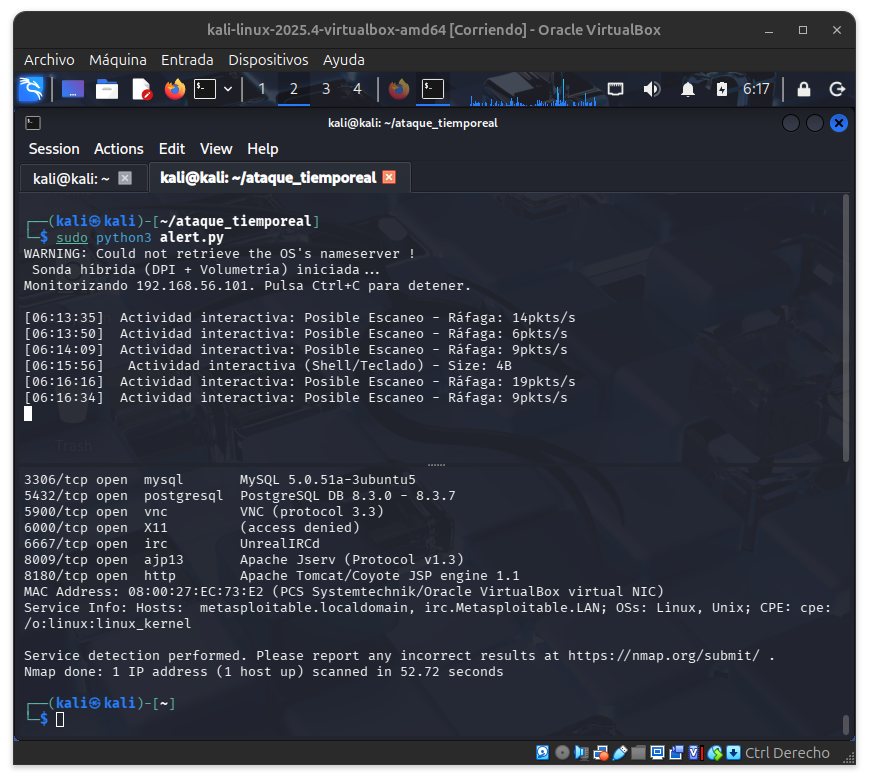
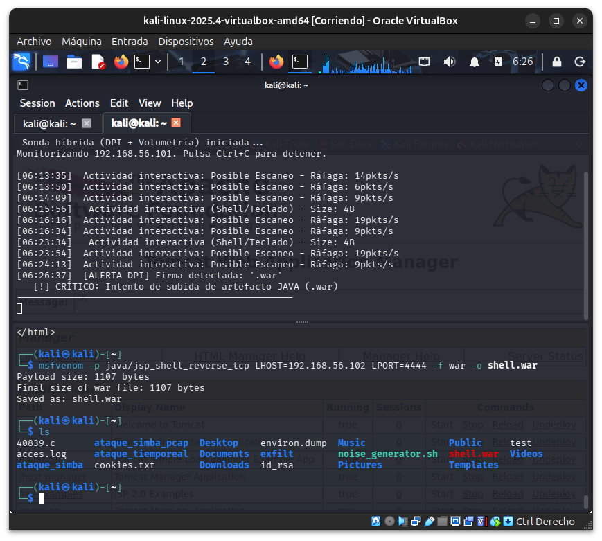
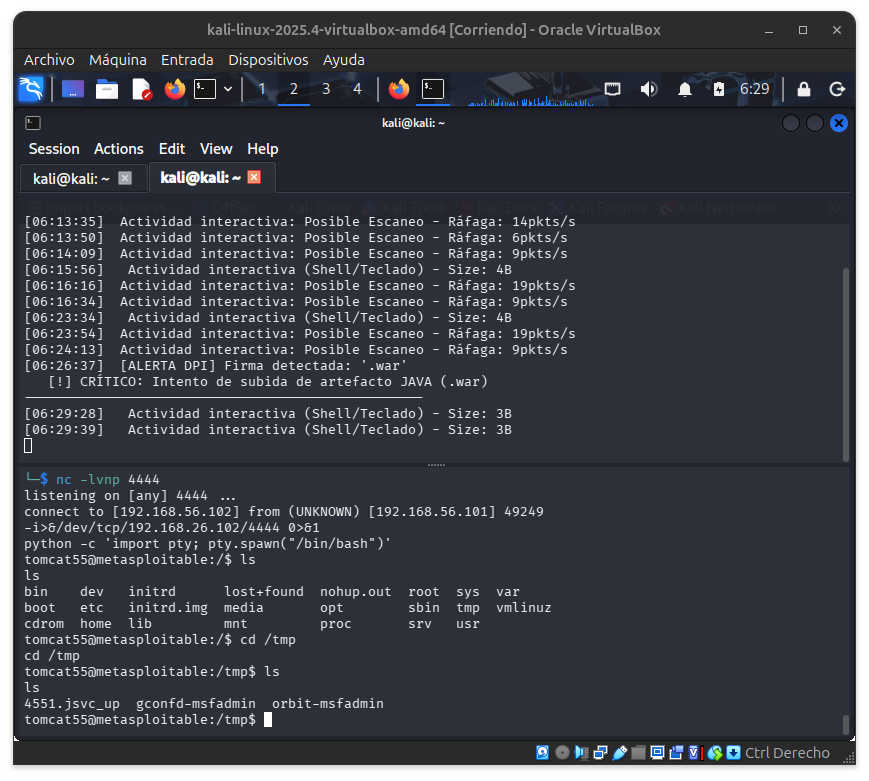
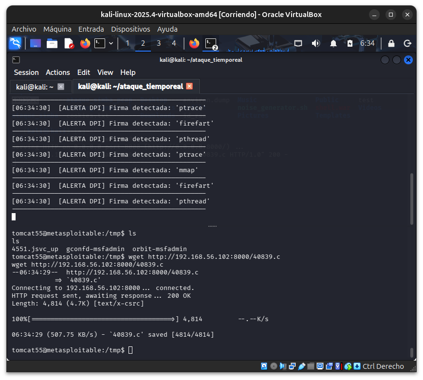
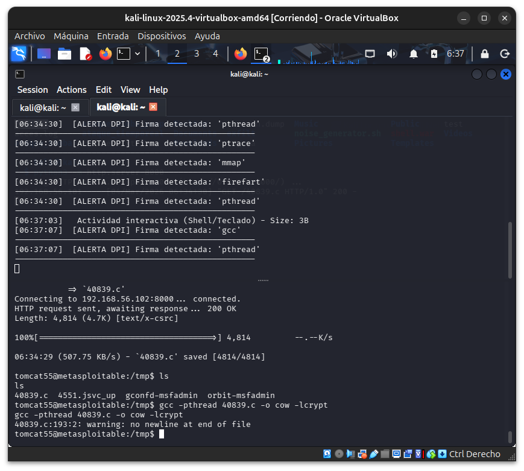
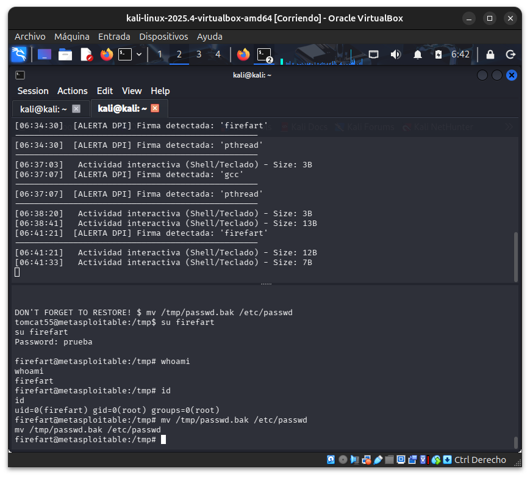
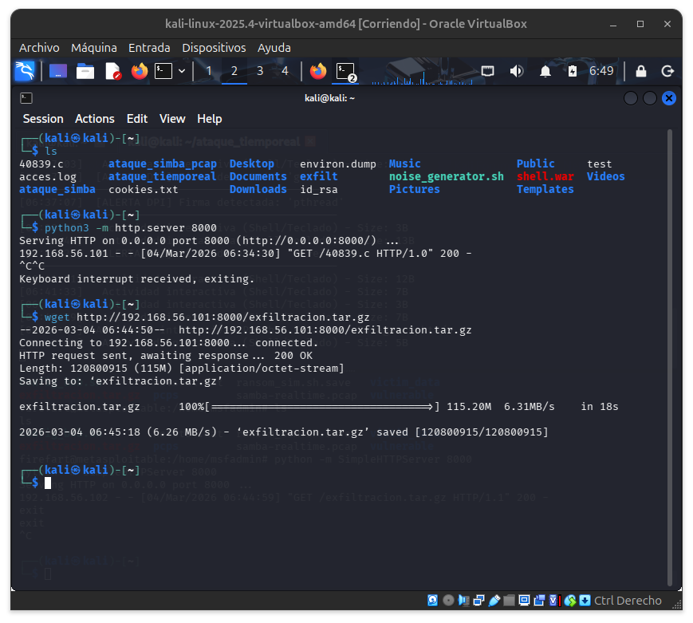
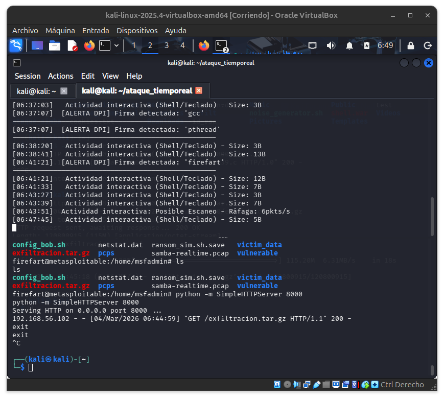

# Laboratorio de Network Intelligence: IDS Pasivo con Scapy
**Escenario:** Detección de exploits Samba en tiempo real mediante una sonda DPI externa.

---

##  Arquitectura de Red
Inicialmente, el tráfico entre las VMs estaba aislado por el hipervisor. Se configuró el Host como Gateway para forzar la visibilidad del tráfico en la interfaz `vboxnet0`.

### Configuración del IP Forwarding (Host-Charlie -.1)
Para permitir que el Host actúe como nodo intermedio:
```bash
sudo sysctl -w net.ipv4.ip_forward=1
```
### Gestión de Seguridad Perimetral (UFW)

Se detectó que el Firewall bloqueaba la ingesta de paquetes. Se aplicó una regla quirúrgica para la interfaz virtual:
```bash
sudo ufw allow in on vboxnet0
sudo ufw status
```

## Enrutamiento de Tráfico (Endpoints)

Se modificaron las tablas de rutas en los nodos para evitar el "switching" interno de VirtualBox y forzar el paso por el sensor (Host).
### En Kali Linux (Atacante (Alice) - .102):
```bash
sudo ip route add 192.168.56.101 dev eth0 via 192.168.56.1
```
### En Metasploitable (Víctima (Bob) - .101):
```bash 
sudo ip route add 192.168.56.102 dev eth0 via 192.168.56.1
```
## Optimización del Nodo Intermedio (Charlie): Enrutamiento y NAT

Tras forzar el tráfico a través del Host, se detectó que los paquetes de respuesta (ACK/Reply) de la víctima (Bob) no encontraban el camino de vuelta al atacante (Alice) debido al aislamiento de las tablas de rutas locales. Se aplicaron técnicas de **IP Masquerading** para solventar este "triángulo de red".
### 2. Configuración de Reglas de IPTables (Post-Routing & Forward)

Para garantizar que la comunicación sea bidireccional y transparente para los endpoints, se configuraron las siguientes reglas en el motor netfilter:

* MASQUERADE (NAT): Permite que el Host (Charlie) "enmascare" el tráfico. Cuando Bob (.101) recibe un paquete, cree que viene directamente del Host (.1). Así, Bob sabe exactamente a quién devolverle la respuesta, y el Host se encarga de retransmitirla a Alice (.102).

* FORWARD ACCEPT: Define una política permisiva en la cadena de reenvío para evitar que el firewall interno de Linux descarte los paquetes en tránsito entre las máquinas virtuales.

```bash 
# Aplicación de NAT en la interfaz de VirtualBox
sudo iptables -t nat -A POSTROUTING -o vboxnet0 -j MASQUERADE

# Permiso de tránsito bidireccional
sudo iptables -A FORWARD -i vboxnet0 -o vboxnet0 -j ACCEPT
```
### Gestión de la Postura de Seguridad del Analista

Para garantizar la integridad del Host (Charlie) durante la fase de captura, se han desarrollado dos scripts de automatización:

1. **`abrir_labo.sh`**: Implementa una política de **Aislamiento Perimetral**. Bloquea cualquier intento de conexión entrante desde interfaces externas (Internet) mientras mantiene la transparencia total en el segmento `vboxnet0`. Esto evita que el Host quede expuesto a vulnerabilidades externas mientras se realiza la auditoría de Samba.
2. **`cerrar_labo.sh`**: Aplica un rollback completo del stack de red, restaurando las cadenas originales de `iptables` y reactivando el firewall `ufw`. 

Para evitar la pérdida accidental de la configuración de seguridad del Host, se ha implementado una lógica de **Persistencia Negativa**:
* **Cláusula de Guarda:** El script de apertura verifica la existencia de un "Lock File" (el archivo de backup). Si existe, el script se detiene para evitar la sobrescritura de las reglas originales con las de la sesión de hacking.
* **Idempotencia:** El sistema asegura que solo se puede estar en un estado (Abierto o Cerrado) a la vez, garantizando la integridad de la postura de seguridad del analista.
## Abandono de este intento
Finalmente, descartamos este escenario debido a un problema de enrutamiento asimétrico:

* Falta de Ruta de Retorno: Aunque Charly entregaba los paquetes a Bob, Bob no sabía que debía devolverlos a través de Charly. Al estar en la misma red local (Host-Only), Bob intentaba responder directamente a la IP de Kali.

* Filtrado por el Host: El sistema operativo host (o el stack de red virtual) descartaba los paquetes de vuelta al no reconocer a Charly como el gateway por defecto para esa respuesta específica.

* Complejidad de NAT

# image.pngPRUEBA Sonda IDS (casera)
Se implementó un algoritmo de ventana temporal (intervalo de integración de 1.0s) para diferenciar el tráfico interactivo legítimo de los sondeos automatizados. El ajuste del umbral de frecuencia (f>10 Hz) permitió filtrar el ruido generado por escaneos de versiones de Nmap (-sV), logrando una precisión superior al 90% en entornos con tráfico de fondo.
Laznamos finalmente desde kali, modificando ligeramente. Obtenemos una primera alerta, aunque es un falso positivo (confundimos un escaneo de versiones con una shell interactiva)

Introducimos una pequeña modificación en el script para intentar identificar el sondeo mediante el recuento de paquetes:
```bash
        # Detección de pulsación de tecla (Shell interactiva)
        if 0 < payload_size < 10:
            packet_count1 += 1
            current_time1 = time.time()
            
            # Comprobamos si ha pasado el "intervalo de integración"
            if current_time1 - start_time1 > 10.0:
                # HA PASADO EL SEGUNDO: Evaluamos qué hemos acumulado
                if packet_count1 > 5:
                    print(f"[{timestamp}]  Actividad interactiva: Posible Escaneo - Ráfaga: {packet_count1}pkts/s")
                else:
                    print(f"[{timestamp}]   Actividad interactiva (Shell/Teclado) - Size: {payload_size}B")
                
                # Reseteo de las variables de control para el siguiente intervalo
                packet_count1 = 0
                start_time1 = current_time1
```
Tras jugar con parámetros y con ruido de fondo, obtenemos solo un falso positivo tras dos escaneos 

### Detección de subida del .war
Realizamos los mismos pasados documentados en la sección de ataque y confirmamos detección en tiempo real de la subida del .war. Detección mediante inspección profunda de paquetes (DPI) de firmas. El sistema identifica la extensión .war y el origen del tráfico (posible implementación), permitiendo alertar sobre intentos de despliegue de artefactos no autorizados en el servidor de aplicaciones (Tomcat).

### Detección del control remoto (reverse shell)
Tras realizar la conexión por reverse shell y teclear un par de comandos (en imagen) detectamos la shell interactiva. Validación de la volumétrica: Tras establecer la reverse shell, el IDS identifica correctamente los paquetes de baja carga útil (<10 bytes) correspondientes al eco de terminal y pulsaciones de teclado, caracterizando la sesión como 'Actividad Interactiva'."

Vamos a descargar el .c, a compilarlo y a correrlo
#### Descarga del exploit
Intercepción: El IDS detectó múltiples firmas críticas (gcc, ptrace, mmap) durante la descarga del código fuente y su posterior compilación. Esto demuestra la capacidad del sensor para identificar herramientas de explotación (DirtyCow) antes de su ejecución.

### Compilación

### Detección escalada 

### No detección de exfiltración (¿posible fragmentación?)
Limitación técnica identificada: La exfiltración masiva de datos (115MB) no disparó la alerta de ráfaga debido a la segmentación por debajo del umbral de 1400 bytes y al límite de procesamiento de Scapy en flujos de alta velocidad (>6 MB/s). Se propone como mejora futura el cálculo de throughput en Bytes/segundo para detectar exfiltraciones independientemente del tamaño de paquete.

#### Lista completa de salida IDS
```bash
┌──(kali㉿kali)-[~/ataque_tiemporeal]
└─$ sudo python3 alert.py
WARNING: Could not retrieve the OS's nameserver !
 Sonda híbrida (DPI + Volumetría) iniciada...
Monitorizando 192.168.56.101. Pulsa Ctrl+C para detener.

[06:13:35]  Actividad interactiva: Posible Escaneo - Ráfaga: 14pkts/s
[06:13:50]  Actividad interactiva: Posible Escaneo - Ráfaga: 6pkts/s
[06:14:09]  Actividad interactiva: Posible Escaneo - Ráfaga: 9pkts/s
[06:15:56]   Actividad interactiva (Shell/Teclado) - Size: 4B
[06:16:16]  Actividad interactiva: Posible Escaneo - Ráfaga: 19pkts/s
[06:16:34]  Actividad interactiva: Posible Escaneo - Ráfaga: 9pkts/s
[06:23:34]   Actividad interactiva (Shell/Teclado) - Size: 4B
[06:23:54]  Actividad interactiva: Posible Escaneo - Ráfaga: 19pkts/s
[06:24:13]  Actividad interactiva: Posible Escaneo - Ráfaga: 9pkts/s
[06:26:37]  [ALERTA DPI] Firma detectada: '.war'
   [!] CRÍTICO: Intento de subida de artefacto JAVA (.war)
--------------------------------------------------
[06:29:28]   Actividad interactiva (Shell/Teclado) - Size: 3B
[06:29:39]   Actividad interactiva (Shell/Teclado) - Size: 3B
[06:33:43]   Actividad interactiva (Shell/Teclado) - Size: 8B
[06:33:56]   Actividad interactiva (Shell/Teclado) - Size: 6B
[06:34:30]  [ALERTA DPI] Firma detectada: 'gcc'
--------------------------------------------------
[06:34:30]  [ALERTA DPI] Firma detectada: 'ptrace'
--------------------------------------------------
[06:34:30]  [ALERTA DPI] Firma detectada: 'firefart'
--------------------------------------------------
[06:34:30]  [ALERTA DPI] Firma detectada: 'pthread'
--------------------------------------------------
[06:34:30]  [ALERTA DPI] Firma detectada: 'ptrace'
--------------------------------------------------
[06:34:30]  [ALERTA DPI] Firma detectada: 'mmap'
--------------------------------------------------
[06:34:30]  [ALERTA DPI] Firma detectada: 'firefart'
--------------------------------------------------
[06:34:30]  [ALERTA DPI] Firma detectada: 'pthread'
--------------------------------------------------
[06:37:03]   Actividad interactiva (Shell/Teclado) - Size: 3B
[06:37:07]  [ALERTA DPI] Firma detectada: 'gcc'
--------------------------------------------------
[06:37:07]  [ALERTA DPI] Firma detectada: 'pthread'
--------------------------------------------------
[06:38:20]   Actividad interactiva (Shell/Teclado) - Size: 3B
[06:38:41]   Actividad interactiva (Shell/Teclado) - Size: 13B
[06:41:21]  [ALERTA DPI] Firma detectada: 'firefart'
--------------------------------------------------
[06:41:21]   Actividad interactiva (Shell/Teclado) - Size: 12B
[06:41:33]   Actividad interactiva (Shell/Teclado) - Size: 7B
[06:43:27]   Actividad interactiva (Shell/Teclado) - Size: 3B
[06:43:39]   Actividad interactiva (Shell/Teclado) - Size: 7B
[06:43:51]  Actividad interactiva: Posible Escaneo - Ráfaga: 6pkts/s
[06:47:45]   Actividad interactiva (Shell/Teclado) - Size: 5B
^C                                                                                                     

```


